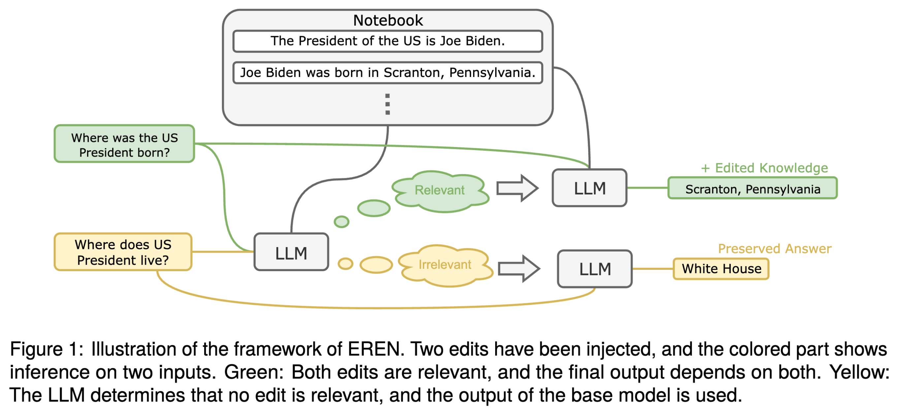
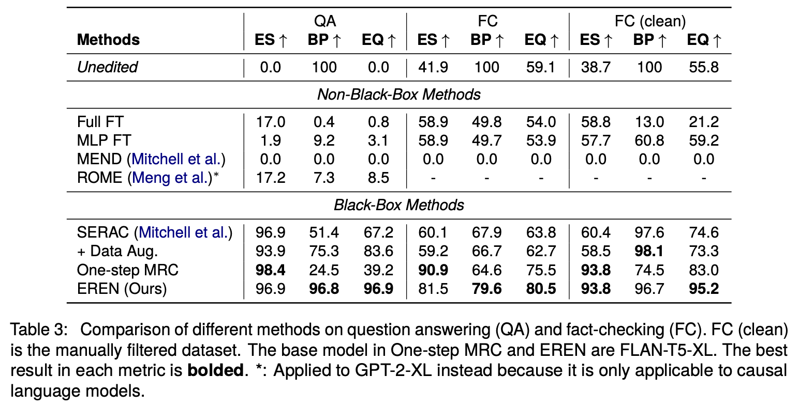

# Robust and Scalable Model Editing for Large Language Models

This repo is the official implementation for the paper [Robust and Scalable Model Editing for Large Language Models (upcoming)](upcoming-paper-link).

- **New LLM editor:** We discover that, with proper prompting methods, instruction-finetuned LLMs can be highly controllable by contextual knowledge and robust to irrelevant context.
- **New and more challenging dataset:** To better evaluate the robustness of model editors, we collect a new dataset, that contains irrelevant questions that are more challenging than the ones in existing datasets in QA. 
- **SOTA performance:** Our method ourperforms SOTA (sequential) model editors in QA and Fact-Checking.



## Result

Our LLM editor significantly outperforms existing methods.

Metrics:

- **ES** (Edit Success): the percentage of examples where the model correctly answers the question after the edit.
- **BP** (Behavior Preservation): the percentage of unrelated examples whose output were not changed by the edit.
- **EQ** (Edit Quality): the harmonic mean of ES and BP.



## Datasets

Our cleaner versions of CounterFact and FEVER are included in this repo in JSON format.

| Dataset     | Task Type                  | Path                              | Number of edits |
| ----------- | -------------------------- | --------------------------------- | --------------- |
| CounterFact | QA based on single edits   | `counterfact/cf_filtered.json`    | 1,024           |
| FEVER       | Fact-Checking              | `fever/fever_filtered.json`       | 1,024           |
| FEVER-Clean | Fact-Checking              | `fever/fever_filtered_small.json` | 128             |
| HotpotQA    | QA based on multiple edits | `hotpot/hotpot.json`              | 1,024           |

> Note that for FEVER, there will be 2048 and 256 examples, because the first half are used as edits and the second half is used as out-of-scope examples to test behavior preservation on unrelated inputs.

## How to Run?

> Execute the following commands inside the `src` directory.

### Installation:

```shell
pip install -r requirements.txt
```

### Evaluation

Our method does not require training and only utilizes pre-trained LLMs, so you just run the following to evaluate our method on each dataset:

```shell
python test_eren.py
```

Results will be dumped to `result` by default, and you can specify the output directory by `--output_dir`.

> Run `python test_eren.py -h` for more options.

## Contact Me

Feel free to contact me (through e-mail by checking my GitHub profile) if you have any questions or discussions. You can also raise questions in the issue section.

## Citation

If you find this repo useful, please cite our paper:

```bibtex
@article{chen2024robust,
  title={Robust and Scalable Model Editing for Large Language Models},
  author={Chen, Yingfa and Zhang, Zhengyan and Han, Xu and Xiao, Chaojun and Liu, Zhiyuan and Chen, Chen and Li, Kuai and Yang, Tao and Sun, Maosong},
  url={https://www.github.com/chen-yingfa/eren},
  year={2024}
}
```
